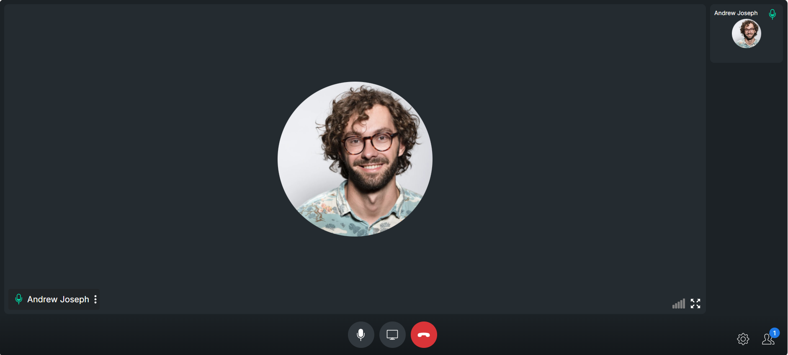
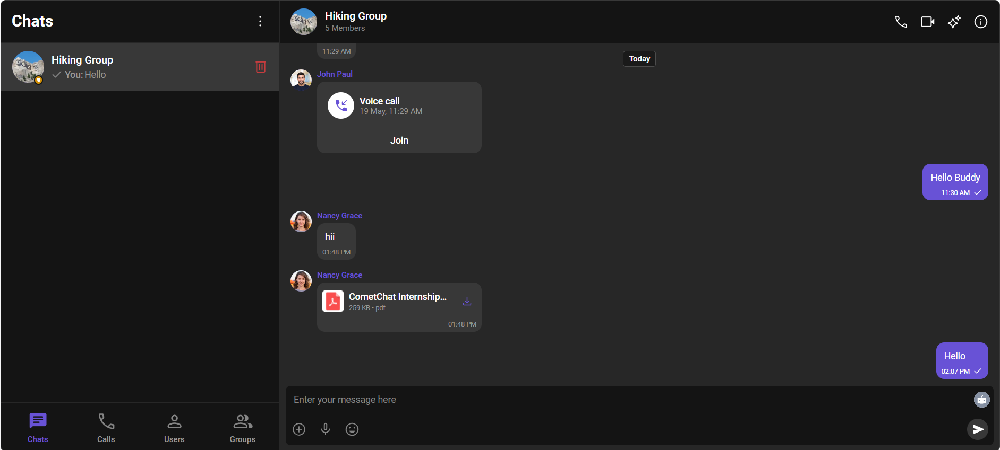

# CometChat Integration Project

A React application demonstrating the integration of CometChat Pro SDK to build a real-time chat and communication platform.

## Table of Contents
- [Overview](#overview)
- [Features](#features)
- [Tech Stack](#tech-stack)
- [Installation](#installation)
- [Setup & Configuration](#setup--configuration)
- [Key Components](#key-components)
- [Challenges & Solutions](#challenges--solutions)
- [Learning Outcomes](#learning-outcomes)
- [Screenshots](#screenshots)

## Overview

This project showcases the implementation of a chat application using CometChat Pro SDK. It provides real-time messaging, user presence, and group chat functionality in a React-based web application.

## Features

- Real-time messaging
- User authentication
- Group chat capabilities
- Message history
- User presence indicators
- Chat notifications
- File sharing
- Voice and video calling
- Message threads and replies

## Tech Stack

- React 18+
- TypeScript
- Vite
- CometChat Pro SDK
- CSS3

## Installation

```bash
# Clone the repository
git clone <repository-url>

# Navigate to project directory
cd cometchat-app

# Install dependencies
npm install

# Start development server
npm run dev
```

## Setup & Configuration

1. Sign up for a CometChat account and create a new app
2. Get your app credentials:

```typescript
// src/main.tsx
export const COMETCHAT_CONSTANTS = {
  APP_ID: "your-app-id", 
  REGION: "your-region",
  AUTH_KEY: "your-auth-key"
};
```

3. Initialize CometChat:

```typescript
const uiKitSettings = new UIKitSettingsBuilder()
  .setAppId(COMETCHAT_CONSTANTS.APP_ID)
  .setRegion(COMETCHAT_CONSTANTS.REGION)
  .setAuthKey(COMETCHAT_CONSTANTS.AUTH_KEY)
  .subscribePresenceForAllUsers()
  .build();

CometChatUIKit.init(uiKitSettings)
```

## Key Components

### Login Component

```typescript
export const CometChatLogin = () => {
  const [uid, setUid] = useState('');
  
  const handleLogin = async () => {
    try {
      await CometChat.login(uid, COMETCHAT_CONSTANTS.AUTH_KEY);
      // Handle successful login
    } catch (error) {
      // Handle error
    }
  };
  
  return (
    // Login UI
  );
};
```

### Chat Interface

```typescript
export const CometChatMessages = (props: MessagesViewProps) => {
  const { user, group, headerMenu } = props;

  return (
    <div className="messages-wrapper">
      <CometChatMessageHeader />
      <CometChatMessageList />
      <CometChatMessageComposer />
    </div>
  );
};
```

## Challenges & Solutions

### 1. User Authentication Flow

**Challenge**: Managing user session and authentication state across the application.

**Solution**: Implemented a centralized authentication context using React Context API:

```typescript
const AuthContext = createContext<AuthContextType | null>(null);

export const AuthProvider = ({ children }) => {
  const [user, setUser] = useState(null);
  
  // Authentication logic
  
  return (
    <AuthContext.Provider value={{ user, login, logout }}>
      {children}
    </AuthContext.Provider>
  );
};
```

### 2. Real-time Updates

**Challenge**: Ensuring messages and presence updates are reflected immediately.

**Solution**: Utilized CometChat's real-time listeners:

```typescript
CometChat.addMessageListener(
  listenerID,
  new CometChat.MessageListener({
    onTextMessageReceived: (message) => {
      // Handle new message
    },
    onUserOnline: (user) => {
      // Handle user presence
    }
  })
);
```

### 3. Mobile Responsiveness

**Challenge**: Creating a responsive layout for mobile devices.

**Solution**: Implemented CSS media queries and flexbox:

```css
@media (max-width: 768px) {
  .conversations-wrapper {
    width: 100vw;
    max-width: 100%;
    min-width: 100%;
    z-index: 1;
  }

  .cometchat-root {
    position: fixed;
    bottom: 0;
    left: 0;
    right: 0;
  }
}
```

## Learning Outcomes

1. **SDK Integration**: Gained expertise in integrating third-party SDKs into React applications
2. **Real-time Communications**: Learned WebSocket-based real-time data handling
3. **State Management**: Improved understanding of complex state management in React
4. **TypeScript**: Enhanced TypeScript skills with complex type definitions
5. **UI/UX Design**: Learned best practices for chat interface design

## Screenshots

### Chat Interface

*Main chat interface showing conversations and messages*

### Group Chat

*Group chat functionality with member list*

### Call Interface

*Voice and video calling interface*

## Contributing

Contributions are welcome! Please read our contributing guidelines.

## License

This project is licensed under the MIT License - see the LICENSE file for details.